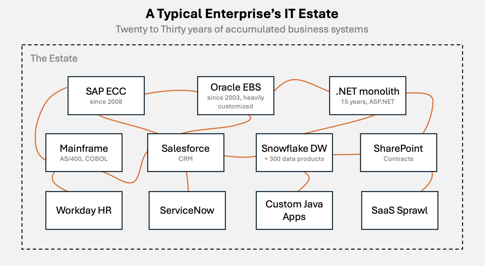
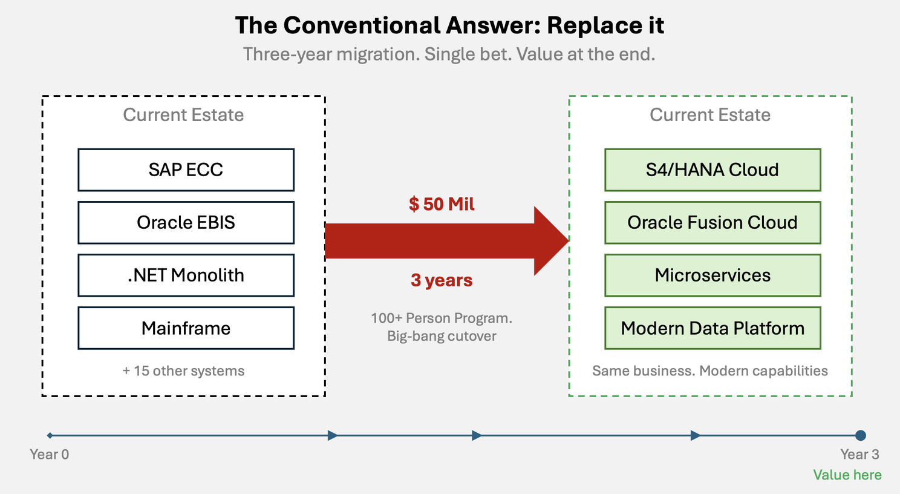
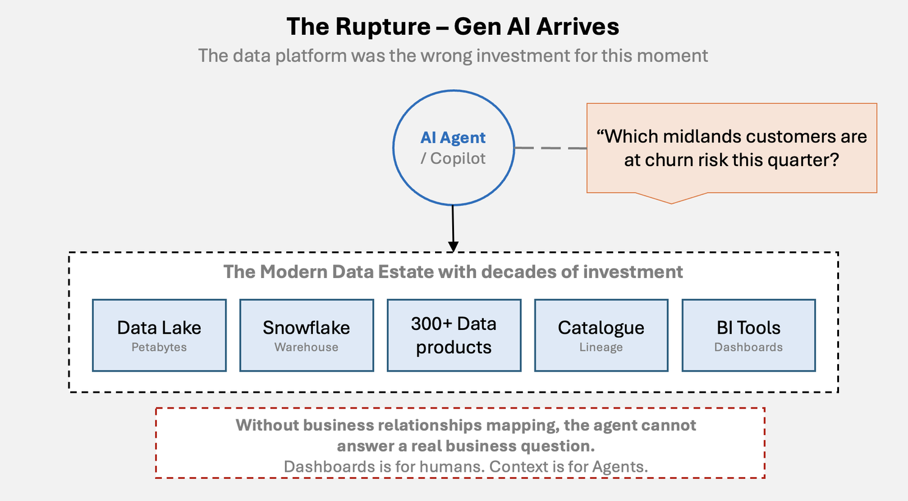
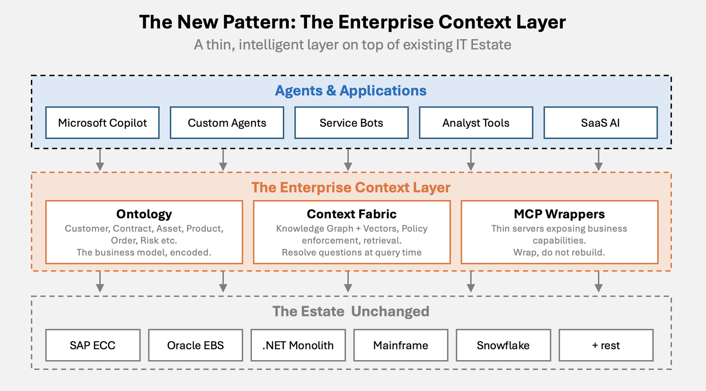
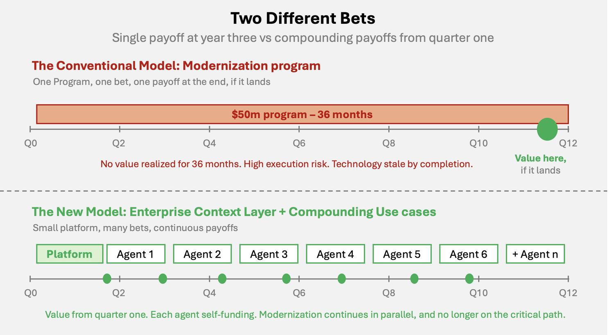

**
This blog post is also published at - https://www.linkedin.com/pulse/enterprise-context-layer-reframe-legacy-modernization-vinoth-haldorai-e300e/
**

Almost every enterprise I work with is sitting on twenty to thirty years of accumulated business systems. An SAP instance that went live in 2008. An Oracle E-Business suite implementation that predates it, customized so deeply that the original consultants left the company a decade ago. A .NET monolith built when ASP.NET WebForms was the modern choice. A mainframe in a corner of the data center that nobody quite knows how to switch off because the overnight settlement runs through it. A Snowflake Warehouse stood up in the last three years, with three hundred data products lovingly catalogued. A Salesforce instance. A ServiceNow instance. A Workday instance. Fifteen other SaaS applications that crept in through departmental budgets.

This is the natural evolution of a business that has been operating. Each layer was the right answer to a real business problem at the time it was built. The .NET monolith automated a process that used to take three people a week. The Oracle EBS instance closed the books in five days instead of fifteen. The data ware house gave the executive team a single view of revenue. All of these are essential. All of it is still doing useful work.

And yet the CIOs are increasingly worried about the compounding complexity, depreciating investments, tangled integrations, thousands of man hours burnt to just keep them alive.

For twenty years, the conventional answer to this estate has been the same. Rip it. Replace it. Migrate it. Modernize it. Cloud-native everything. Microservices, eventually. Get to the target state and the problems go away. The answer is so deeply embedded in the way enterprises think that very few CIOs even pause to ask whether it is still the right answer. But is that really the way forward in this era?

## The Two Doors:

Every such Enterprise is standing in front of two doors. They both look like the path forward.

Behind the first door is the modernization program. The thirty-month transformation. The hundred-person team. The board pitch for an investment proposal of Fifty Million dollars that promises a modern estate by year three. This door has been the answer for so long that most CIOs cannot imagine another one. Their suppliers know how to sell it. Their procurement knows how to buy it. Their boards know how to approve it. It is the door of conventional wisdom.

Behind the second door is something newer, smaller, and far less obvious. It does not promise to replace what you have. It promises to make your IT estate intelligent. It does not need a thirty-month program. It needs a sixteen-week one. And it does not ask the board to bet Fifty Million dollars on a single payoff three years from now. It asks the board to make a series of small, compounding bets, the first of which pays back inside a quarter.

Which of these two doors are the right choice for this era?

## The Conventional Answer - Legacy Modernization:

This is what a conventional answer behind the first door actually looks like. A typical enterprise modernization program of this kind that has dominated the last two decades has the following shape:

A discovery phase that lasts six to nine months. A target architecture defined by a system integrator at considerable expense. A migration roadmap with three to five waves. A delivery team that scales to over a hundred people at peak. A change management program that runs in parallel. A cutover plan that everyone secretly dreads. A go-live date that slips at least once. A stabilization phase that lasts longer than anyone admits in the board updates.

In essence: the deal looks like this:

There are two features that puts the model under pressure in current times.

### Value is back-loaded:

The business does not see meaningful return until the migration is substantially complete. For thirty-months, the program is spending capital and consuming attention without producing operational lift. The justification for this is always the same. The new estate will be more agile, cheaper to run, easier to extend. The justification depended on a world in which the strategic environment was stable enough for three-year programs to make sense.

That world is no longer ours.

### Modernization arrow points at a static target:

The target state is defined at the start of the program and then chased for three years. The technology landscape, in the meantime, does not wait. By the time most large modernization programs complete, the technology they were migrating to has been superseded twice. The classic example is the wave of enterprises that started Hadoop modernization programs in 2015 and finished them in 2019, by which time the strategic relevance of Hadoop had collapsed. The same pattern is now playing out with several of the cloud-native architectures that were the gold standard in 2020.

Both of these features were always present. For twenty years, they were tolerable. The Strategic environment moved slowly enough that a three-year program could land before the world changed too much. The cost of waiting for value was acceptable because there was no alternative way to deliver it.

Then 2023 happened.

## The Rupture:

Generative AI arrived in public consciousness in 2023, and by 2024, every enterprise CIO was being asked the same question by their board. What is our AI Strategy? By 2025, the question had sharpened. Why is our Copilot rollout failing?

The pattern was identical across sectors. The enterprise had spent a decade and millions of dollars building modern data infrastructure. The data lake was in place. The warehouse was in place. The data products were governed, catalogued, and tracked. The dashboards were beautiful. And yet the AI Agent could not answer a basic business question.

The question I use in client conversations is a real one I heard from a Fortune 500 CIO in 2024. Which customers in the midlands are at churn risk this quarter? A junior analyst could answer that question in twenty minutes with a SQL query, a spreadsheet, and a phone call to the regional account team. The enterprise copilot, sitting on top of the three hundred data products and a governed warehouse, could not answer it at all.

This is nothing to do with the effectiveness of the AI language model. The data estate is built to serve dashboards. Dashboards answer questions that were known in advance. The questions were defined, the metrics were modelled, the joins were materialized, the visualizations were tuned. A whole industry grew up around the discipline of doing this well. The data is there. The meaning is not. The agent cannot resolve a question because the relationships, the entities, and the context were never modelled.

AI agents should not just answer known questions. They should also answer unknown ones. They need to traverse relationships, resolve entities, compose context, apply judgement. They do not want a curated table. They want a model of the business. And that is precisely what a decade of data warehousing has not produced.

So we arrive at the hard truth. The modernization program, even if it completes, does not solve this. A cleaner ERP or a faster warehouse does not give you the meaning. The conventional answer at this point is to commission another modernization program. But it will not provide the much needed meaning to the data.

## The New Answer - Enterprise Context Layer:

There is a different answer. Enterprise Context Layer. It is the second door. And it looks like this.

The idea is deliberately simple. You do not touch the estate. You add a layer on top of it. The layer has three components, and they are the three components every enterprise will be building over the next five years whether they call them by these names or not.

### The Ontology

The ontology is the business model of your company, expressed once, agreed across the organization, and made available to machines. A Customer is one thing. A contract is one thing. An asset is one thing. The entities and the relationships between them are defined in a single model that becomes the source of meaning for every downstream consumer.

The ontology is not a data model. A data model describes how data is stored. The same Customer entity might live in fourteen different schemas across fourteen different systems. The ontology gives it one identity. It is also not a taxonomy. A taxonomy classifies things into hierarchies. The ontology captures the rich relationships, constraints, and rules that govern how the business actually operates.

The hard part of building the ontology is the political agreement across business units. For example, What a Customer actually is. The technology choices matter, but they are second order. The choice is between Property graphs, RDF, Neo4j, Stardog. Microsoft Fabric semantic models and Palantir Foundry. The first-order of question is whether your organization can agree on the meaning of its own business.

### The Context Fabric

The context fabric is the runtime. When an agent asks a question, the context fabric resolves it. It works out which entities are involved. It traverses the relationships. It pulls the right structured data from the right systems and the right unstructured data from the right document stores. It applies entitlements so that agent only sees what its user is permitted to see. It composes the context and hands it to the language model.

The context fabric is where the most active engineering innovation is happening today. GraphRAG, the pattern introduced by Microsoft Research in 2024, is the most influential reference architecture. It marries knowledge graph traversal with vector search and produces dramatically better results than either approach alone. Every serious enterprise AI vendor is now building some variant of this pattern. The implementation choices are plenty, but the principle is durable.

### The MCP Wrappers

The MCP Wrappers are the most pragmatic piece of the puzzle. The Model Context Protocol, open-sourced by Anthropic in late 2024 and now the de facto standard, is the way the agents talk to enterprise systems. An MCP server is a thin piece of software that sits alongside a system of record and exposes its business capabilities through a standard interface.

Critically, an MCP server is not a data extract. It does not pull data out of system into a new lake. It exposes capabilities. Get Customer 360. List Open Orders. Get Invoice Status. The MCP server is a small, surgical piece of software, typically a few hundred lines of code that wraps an existing system and makes its business logic available to agents. The system itself does not change. Its workflows do not change. A well-built MCP wrapper on a thirty-year-old Monolith application delivers more agent-ready value in ninety days than a half-finished cloud migration delivers in three years.

These three components together are the Enterprise Context Layer. They sit between the agents and applications above and the unchanged estate below. They are the operating system between your data estate and your AI estate. And they are built in weeks, not years.

## Two Different Bets

The shift from the old pattern to the new is not just an architectural decision, but a fundamentally different way of placing the bet.

The old model was a single bet with a single payoff. Three years, Fifty Million dollars. If the strategic environment had moved on, the new state was already out of date by the time it went live. The risk profile was binary and the timeline was unforgiving.

The new model is a portfolio of small bets with compounding payoffs. The Enterprise Context layer itself is a sixteen-week build with a small senior team. The cost is in high hundreds of thousands of dollars, not the tens of millions. The first agent goes live in the first quarter. The second agent goes live two months later. Each agent delivers measurable business value, often enough to fund the next two agents. The platform is the same. The use cases are independent. The value compounds.

What this means in practice for an enterprise CFO is profound. Instead of approving a single Fifty Million dollars capital program with a payback in year three, the CFO is approving a few thousands or hundreds of thousands of dollars of platform investment followed by a self-funding use case pipeline. Each use case has its own business case. Each can be measured, evaluated, killed or scaled. This portfolio risk is dramatically lower.

Does that mean that all modernization programs can be stopped? The modernization does not stop, but it stops being the bottleneck. The S4/HANA migration, the monolith decomposition, the cloud move, they all continue. But now they happen behind the context layer. They are no longer on the critical path for AI value. The context layer carries the AI workload. The modernization carries the operational workload. They run in parallel with different funding, different timelines, and different risk profiles. The dependency on waiting for three years to realize AI value is broken.

## The Operating Model This Demands

The architectural concept is simple enough. But the part most enterprises will get wrong is the operating model. Five capabilities have to come into existence, and most enterprises today do not have them.

### Ontology Stewardship

A small senior team of few handful of people owns the business ontology. Mix of domain experts and knowledge engineers. They are the ones who decide what a Customer is, when the definition changes, how new entities are added, and how conflicts between business units are resolved. This function reports to the CDO or CTO and operates at architecture-board cadence. Most enterprises today do not have this. The closest existing function is the data governance team, but data governance is about data quality and accuracy, not about the business meaning. Ontology stewardship is a different discipline that needs different people.

### Context Engineering

The new technical discipline. Context Engineers design how agents retrieve, compose, and ground their context. They sit between data engineering and AI engineering. They own the Context Fabric pipelines, the retrieval quality, and eval harnesses, the prompt patterns that bind agents to the ontology. A mature enterprise will have eight-to-fifteen-member team, embedded across the product teams rather than concentrated in a central platform team.

### MCP and Integration Engineering

This will have to be federated. Each domain team owns its own MCP servers, with a central platform team setting standards. The platform team curates a library of reference MCP server patterns. The domain teams build to those patterns and own their own runtime. This federated model scales in a way that a centralized integration team never could, and it puts ownership where the business knowledge actually lives.

### AI Governance and Trust

Joint accountability across CISO, CDO, CIO, and legal. Owns evaluations, red-teaming, model risk, entitlement policy, audit. This function barely exists in most enterprises today and will be mandatory within eighteen months. With EU AI Act, the FCA's emerging guidance, ISO 42001 for AI Management standards, NIST AI RMF for AI Risk Management framework,  the regulatory momentum is one-directional. Enterprises that build this capability deliberately, ahead of the regulatory cliff, will move faster. Enterprises that wait will be reactive and slow.

### Value Realization and Adoption

The capability that translates context-layer investment into business outcomes. Product managers embedded in business domains, measuring agent-driven decisions and outcomes, not just platform metrics. This is the function that makes the difference between AI program that produces beautiful demos and one that moves the P&L.

The structural shift across these five capabilities is meaningful. The skill mix is different. The cultural shift is profound, from building pipes to curating meaning.

## Conclusion: The Question has changed

For thirty years, the question every enterprise architect asked was: how do we replace what we have? It is the wrong question for this decade.

The question for this decade is: how do we make what we have intelligent?

These are different questions with different answers. The first question is answered by a legacy modernization program. The second is answered by Enterprise Context Layer. The first takes three years and fifty Million dollars. The second takes sixteen weeks and thousands or hundreds of thousand dollars for the foundation, with use cases self-funding from there. The first asks the business to wait. The second asks the business to compound.

The firms that understand this difference are going to spend the next decade compounding value on top of the estates they already own. The firms that do not are going to spend the next decade finishing migrations to estates that will be obsolete by the time they go live.

The choice between the two doors is the most consequential architecture decision a CIO will make in this decade. And the most meaningful choice is clear. Wrap, do not rip. Add meaning. And compound value.

As exciting as this sounds, many enterprises would have a question: How to actually start this? I will go deeper on this disposition framework in my next article.

## References

Fowler, M. (2024). StranglerFigApplication. [https://martinfowler.com/bliki/StranglerFigApplication.html](https://martinfowler.com/bliki/StranglerFigApplication.html). Wrap, do not rebuild - Martin Fowler's strangler-fig pattern.

Sequeda, J. and Lassila, O. (2021). _Designing and Building Enterprise Knowledge Graphs_. Morgan & Claypool. The practitioner reference for how ontologies and knowledge graphs are designed and operated at enterprise scale.

Edge, D. et al. (2024). _From Local to Global: A Graph RAG Approach to Query-Focused Summarization_. Microsoft Research. The foundational paper on GraphRAG, the most influential reference architecture for the Context Fabric layer.

Anthropic (2024). _Introducing the Model Context Protocol_. [modelcontextprotocol.io](http://modelcontextprotocol.io/). The open specification for how agents connect to enterprise systems and data sources.

NIST (2023). _Artificial Intelligence Risk Management Framework (AI RMF 1.0)_. National Institute of Standards and Technology. The reference framework for AI risk management cited in the Operating Model section.

ISO/IEC 42001:2023. _Information technology — Artificial intelligence — Management system_. International Organization for Standardization. The first international management system standard for AI governance.

European Parliament (2024). _Regulation (EU) 2024/1689 on Artificial Intelligence (EU AI Act)_. The legislative frame shaping AI governance obligations across European enterprises