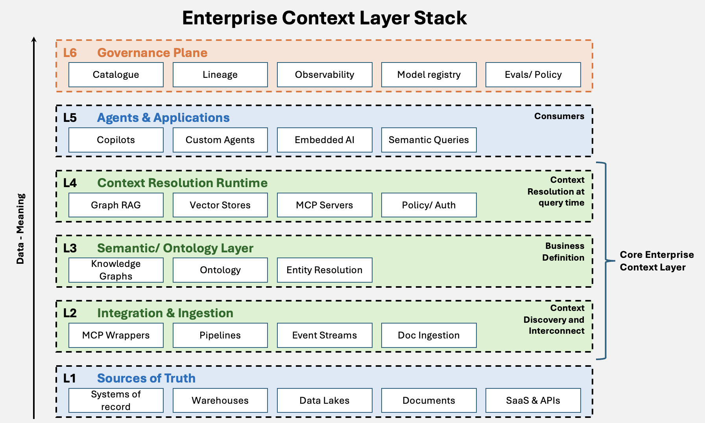

The four largest hyperscalers have provided guidance to the market that they would be spending approximately \$700 Billion in 2026 on their capital expenditure, out of which a majority of 2/3rd would be tied to building their AI infrastructure backbone directed almost entirely at compute, data centres and power. According to Goldman Sachs this is expected to grow to a cumulative capex of \$5 Trillion between 2025 and 2030. This is remarkable and uncharacteristic of the typically capital-light software companies the market has been accustomed to since the last decade. This spend doubled from their 2025 levels, and now comfortably outpaces their respective free cash flows which has put their traditional DCF based valuations under pressure. The industry is fundamentally changing, and software majors are building up assets in a way a utility major would do. Amazon's free cash flow is set to turn negative in 2026. Meta's shares fell over 9% the day it raised its spending guidance. Clearly the firms are betting on AI as if their survival depends on it, and taking uncomfortable measures to do so. 

On the other hand, enterprises around the world are yet to realise value from their AI investments. According to a report from MIT, 95% of enterprise generative-AI pilots show no measurable impact on their P&L. S&P Global found that 42% of firms abandoned most AI initiatives in 2025. Gartner reported that at least 30% of AI POCs fail. All these independent reports converge on the fact that AI initiatives are failing to realize value. The reports also converge on why these AI initiatives fail. MIT names it as a "learning gap" of integration and context, not model quality. Each of the other independent reports blames data, integration and adoption, not the model. According to a Gartner study in 2026, "*organizations that report successful AI initiatives invest up to four times more (as % of revenue) in foundational areas, such as data quality, governance, AI-ready people and change management, compared to those that experience poor outcomes from AI*"

But what precisely do these "foundational areas" mean? When all these reports state that AI projects fail to scale, this failure is attributed to the architectural problem of providing the correct information, at the right time to the right AI consumer. In other words it is a "**context problem**". The model capability is no longer the binding constraint. An OpenAI published study described how building the right context layer helped employees go from question to insight in minutes, not days.

### **What is Context Layer**
A Context Layer is the architectural tier that sits between the AI models or agents and an organisation's data, tools, knowledge and rules. Its job is to assemble, govern and deliver the right information to the model at inference time. It is about translating raw metadata into governed business meaning with provenance trails that make answers auditable. 

### **How it evolved**

The context layer evolved from an afterthought to a named category in roughly 4 phases. From 2020 to 2022, context simply meant the prompt. RAG was published as a research technique, but production systems mostly relied on prompt engineering. From 2022 to 2024, RAG industrialised. Vector databases (Pinecone, ChromaDB, Qdrant), orchestration frameworks (LangChain, LlamaIndex), function calling from mid-2023, and a long-context arms race that took the range from 4K to over a million tokens all materialised. But so did the realisation that bigger context windows and native retrieval did not solve grounding; they introduced cost, latency and "context rot".
The third phase, from November 2024, was the protocol era. Anthropic released the Model Context Protocol as an open standard for connecting models to tools and data. OpenAI, Google DeepMind, Microsoft and thousands of teams adopted it. The official MCP registry launched in September 2025 and grew to nearly 2000 entries within months, and in December 2025 Anthropic donated MCP to the Agentic AI Foundation under the Linux Foundation, making it vendor-neutral and community-governed. By late 2025 there were more than 10,000 public MCP Servers deployed. In parallel "context engineering" was coined by Andrej Karpathy and Tobi Lutke as the successor to prompt engineering. Context engineering is the practice of architecting the entire information environment, not just the prompt but memory, tools, retrieval, and state. 
The fourth phase arrived in 2026, which elevated the context layer to a named category. By March 2026, a16z had picked up the category in "Your Data Agents Need Context" confirming what practitioners had worked out: agents fail in production because they cannot read enterprise meaning, not because the models are weak. Bessemer's 2026 infrastructure roadmap argues that as models become commoditised, differentiation shifts to the memory and context layer, which is now emerging as its own infrastructure category. 

### **The Enterprise Context Layer - A Prescriptive View**

The Enterprise context layer, from an opinionated perspective, consists of 6 layers. 

**L1 Sources of truth:** Systems of record, warehouses, data lakes, documents, SaaS and APIs. The layer does not move them. It reads them where they already are.

**L2 Integration and ingestion**: MCP wrappers, CDC pipelines, event streams, document ingestion. This is the wrapping tier. A twenty-year-old core is made to speak business language without being rebuilt.

**L3 Semantic and ontology layer:** Knowledge graph, ontology, entity resolution. Raw metadata becomes governed business meaning. The enterprise's definitions live here, once, instead of being re-derived in every project.

**L4 Context resolution runtime:** GraphRAG, vector stores, MCP servers, policy and authorisation. Context is assembled, governed and delivered at query time, for the question actually asked.

**L5 Agent and application layer:** Copilots, custom agents, embedded AI, semantic queries. The consumers read business meaning, not raw tables.

**L6 Governance plane:** Catalogue, lineage, observability, model registry, evaluations and policy. This is a plane, not a stage. Governance runs through every layer, not after them.

There is no Memory layer. Memory is agent-scoped and learned through experience. Enterprise context is enterprise-scoped and deliberately curated. Folding one into the other blurs the line this layer exists to hold. 

### **The Trends emerging with Enterprise Context Layer**
As it is evident that the enterprise context layer is emerging as the critical stack for AI success, multiple parties across the stack are accelerating in the race to own the domain. The Foundation model providers, data vendors, hyperscalers and practitioners are approaching the problem from their vantage point to bind a workable solution. As this landscape evolves few directions could emerge. 
1) **Agent Evolution:** Consolidation of the context layer into a durable "**system of intelligence**" tier, with the long-run end state framed as a deterministic and cognitive **digital twin** that understands the state of the business, captures rules and exceptions, supports human judgement, and teaches agents to improve, maturing over years rather than appearing as a single product
2) **Standards Battle between Open Interchange vs Platform gravity**: A standards battle over semantic portability between open interchange (OSI, MCP) versus platform gravity (Microsoft IQ, Palantir Ontology), for building federated foundational context that encodes how a company thinks, decides and acts. 
3) **Memory as governed infrastructure**: Memory maturing from frameworks into governed infrastructure.
4) **Governance hardening as a forcing function**: Governance hardening as a forcing function, with increasing focus on memory manipulation protection as agents gain persistent state. Unified governance platforms will combine gateway and security functionality, accelerated by the EU AI Act timeline
5) **Self-improving context**: Contexts will evolve from agent experience rather than being hand-curated, which will make the context layer a learning system rather than a static integration layer. 

The industry is now converging into a unified synthesis. The scarce asset in enterprise AI is no longer intelligence, but legible, governed, portable meaning, and the context layer is the architectural answer everyone is now racing to own. 

### **References**

- CNBC, "Tech AI spending approaches \$700 billion in 2026, cash taking big hit" (February 2026). [https://www.cnbc.com/2026/02/06/google-microsoft-meta-amazon-ai-cash.html](https://www.cnbc.com/2026/02/06/google-microsoft-meta-amazon-ai-cash.html)

- Goldman Sachs Research, "Private Markets Are Expected to Have a Growing Role in Data Center Financing" (June 2026). [https://www.goldmansachs.com/insights/articles/private-markets-expected-to-have-growing-role-in-data-center-financing](https://www.goldmansachs.com/insights/articles/private-markets-expected-to-have-growing-role-in-data-center-financing)

- MIT Project NANDA, "The GenAI Divide: State of AI in Business 2025" (Challapally, Pease, Raskar and Chari, July 2025). Coverage: [https://fortune.com/2025/08/18/mit-report-95-percent-generative-ai-pilots-at-companies-failing-cfo/](https://fortune.com/2025/08/18/mit-report-95-percent-generative-ai-pilots-at-companies-failing-cfo/)

- S&P Global Market Intelligence, "Voice of the Enterprise: AI and Machine Learning, Use Cases 2025" (October 2025). [https://www.spglobal.com/market-intelligence/en/news-insights/research/2025/10/generative-ai-shows-rapid-growth-but-yields-mixed-results](https://www.spglobal.com/market-intelligence/en/news-insights/research/2025/10/generative-ai-shows-rapid-growth-but-yields-mixed-results)

- Gartner, "Gartner Predicts 30% of Generative AI Projects Will Be Abandoned After Proof of Concept by End of 2025" (July 2024). [https://www.gartner.com/en/newsroom/press-releases/2024-07-29-gartner-predicts-30-percent-of-generative-ai-projects-will-be-abandoned-after-proof-of-concept-by-end-of-2025](https://www.gartner.com/en/newsroom/press-releases/2024-07-29-gartner-predicts-30-percent-of-generative-ai-projects-will-be-abandoned-after-proof-of-concept-by-end-of-2025)

- Gartner, "Gartner Says Organizations With Successful AI Initiatives Invest Up to Four Times More in Data and Analytics Foundations" (April 2026). [https://www.gartner.com/en/newsroom/press-releases/2026-04-16-gartner-says-organizations-with-successful-ai-initiatives-invest-up-to-four-times-more-in-data-and-analytics-foundations](https://www.gartner.com/en/newsroom/press-releases/2026-04-16-gartner-says-organizations-with-successful-ai-initiatives-invest-up-to-four-times-more-in-data-and-analytics-foundations)

- OpenAI, "Inside Our In-House Data Agent" (2026). [https://openai.com/index/inside-our-in-house-data-agent/](https://openai.com/index/inside-our-in-house-data-agent/)

- Lewis et al., "Retrieval-Augmented Generation for Knowledge-Intensive NLP Tasks" (2020). [https://arxiv.org/pdf/2005.11401](https://arxiv.org/pdf/2005.11401)

- Anthropic, "Donating the Model Context Protocol and Establishing the Agentic AI Foundation" (December 2025). [https://www.anthropic.com/news/donating-the-model-context-protocol-and-establishing-of-the-agentic-ai-foundation](https://www.anthropic.com/news/donating-the-model-context-protocol-and-establishing-of-the-agentic-ai-foundation)

- Andreessen Horowitz, "Your Data Agents Need Context" (Cui and Li, March 2026). [https://a16z.com/your-data-agents-need-context/](https://a16z.com/your-data-agents-need-context/)

- Bessemer Venture Partners, "AI Infrastructure Roadmap: Five Frontiers for 2026" (2026). [https://www.bvp.com/atlas/ai-infrastructure-roadmap-five-frontiers-for-2026](https://www.bvp.com/atlas/ai-infrastructure-roadmap-five-frontiers-for-2026)

