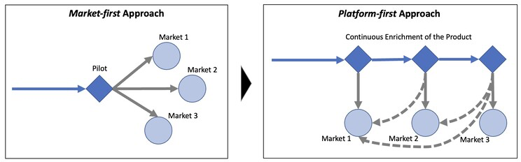

For decades, an ERP system remains as a backbone for large enterprises. This is the living, breathing system that binds the business processes and transactions together, and consequently determines the pace of operations, and complicity to processes. The ERP system also remains as the stage for conflicting source of friction between the headquarters and regional and business divisions, symbolizing the bureaucracy that comes to define the enterprises. Due to aforementioned reasons, any IT programs related to ERP - be it implementation, modernization or transformation - remains an arduous undertaking that require mega budgets, alignment with multiple groups within the organization, and are inherently complex due to the varying needs of different geographies and business areas.

### **The perils of traditional "Market-First" approach to ERP Implementation**

One of the primary causes for complexity behind ERP programs emanates from the attempt to build it as a pilot oriented approach, where in the required capabilities are defined and crystallized towards a specific market, while extracting the globally harmonized processes and capabilities as a logical blueprint to be templatized for the rest of the markets. While logically sound, this approach often fails in execution in practice due to several factors. Usually constrained by a set timeline and budget, these programs tend to prioritize fulfilling the needs of the pilot, over defining a comprehensive global blueprint, which is often attempted as an afterthought rather than a central strategy. Also, such programs tend to assemble a core committee intended to serve as a representation of the organization's various functions and ensure that the key users are empowered to drive and expedite decision-making while reasonably prioritizing the needs of their respective divisions. However, this approach can lead to structural limitations in decision cycles, as the process may become subjective and prone to bias. And hence naturally, the ERP systems built on such foundation, continues to perpetrate complexity hindering the realization of the intended objectives.

To overcome such obstacles, the organizational mindset and operating principles while implementing ERP programs should shift towards 3 core principles.

### **Mindset Shift 1 - From "Market-first" approach to "Platform-first" approach**

To achieve the "Platform-first" approach, ERP implementation should focus on building a global blueprint with standardized processes and capabilities as the central strategy. This approach prioritizes defining comprehensive global requirements and designing a solution that meets the needs of all markets. Instead of building a solution for a specific market and attempting to templatize it for others, a platform-first approach prioritizes the design of the global solution, which can then be tailored to meet local requirements. This shift in mindset enables the implementation of a solution that is not only fit for purpose but also scalable and sustainable, leading to better outcomes for the organization.

Defining a global blueprint involves consideration of factors such as maintenance and support costs, long-term viability, and flexibility to accommodate future business changes. Defining the global blueprint should be an iterative process that involves continuous feedback from all stakeholders and regular updates based on changing business needs. This ensures that the solution is constantly evolving and improving to meet the needs of the organization and its markets.

### **Mindset Shift 2 - From "Mega programs" to "Continuous Enrichment"**

Moving from "Mega programs" to "Continuous enrichment" is another key mindset shift that can significantly improve the success of ERP implementation. Instead of implementing large-scale programs that attempt to deliver all requirements at once, a continuous enrichment approach emphasizes the importance of delivering incremental improvements over time. This shift in mindset recognizes that ERP implementation is an ongoing process that should evolve in response to changing business needs and market requirements. By prioritizing continuous enrichment, organizations can deliver solutions that are better aligned with the evolving needs of their business units, markets, and customers.

To achieve continuous enrichment, it's important to create a culture of agility and collaboration, with regular communication and feedback loops between IT and business stakeholders. This approach can help organizations to identify opportunities for improvement and make necessary adjustments in a timely manner. In addition, organizations can leverage modern cloud-based ERP solutions that offer built-in flexibility, scalability, and security, enabling them to adapt to changing market conditions and customer needs. With a continuous enrichment approach, ERP implementation becomes an ongoing journey of improvement, rather than a one-time project.

### **Mindset Shift 3 - Market variations as "Lego blocks" rather than "Annexation"**

To achieve a more efficient and effective approach to localizations, the mindset shift should move away from the traditional annexation method and toward a modularization approach. In this approach, market variations are treated as "Lego blocks," where a catalog of capabilities is developed for each market. Rather than building a localized version on top of a standard ERP template, a catalog of capabilities is developed that can be picked and chosen to meet the specific needs of each market. This approach allows for greater flexibility in the design and implementation of the ERP system, ensuring that each market's needs are met without compromising on the overall standardization of the system. By embracing a catalog-based approach to localizations, organizations can streamline their ERP implementation process and improve the efficiency and effectiveness of their operations.

### **Conclusion**

The traditional "market-first" approach to ERP implementation is no longer adequate in today's dynamic and complex business environment. Organizations need to adopt a "platform-first" approach that prioritizes the design of a comprehensive global blueprint with standardized processes and capabilities, which can be tailored to meet local requirements. Additionally, they should embrace a continuous enrichment approach that emphasizes incremental improvements over time, and market variations should be treated as "Lego blocks" rather than annexations. By adopting these mindset shifts, organizations can streamline their ERP implementation process, reduce complexity, and improve the efficiency and effectiveness of their operations. ERP implementation is not a one-time project but an ongoing journey of improvement that requires collaboration, agility, and a commitment to delivering value to the organization and its stakeholders. With the right mindset and operating principles, ERP systems can become a strategic asset that enables organizations to innovate, compete, and grow in the digital age.
